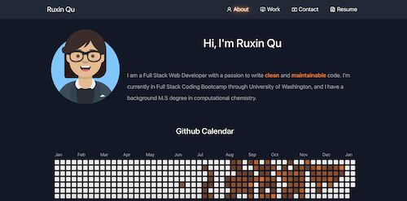

# react-portfolio 

## Description
This is Ruxin Qu's react portfolio. It's made with [create-react-app](https://create-react-app.dev).

View deployed link: 

 

## Installation

1. Run `git@github.com:RuxinQu/react-portfolio.git` on the terminal to git clone the repo.
2. Then run `npm install` to download all the packages.
3. Run `npm start` to start the server.

## Usage
1. Click the link and see my portfolio! 
2. The website is responsive to different screen sizes.
3. User is able to send messages through the contact form.
3. The following animation shows the website's appearance and functionality:

›

## Technologies Used
- [Nodemailer](https://nodemailer.com/about/)
- [Avataaars2](https://www.npmjs.com/package/avataaars2)
- [React-Icons](https://react-icons.github.io/react-icons/)
- [React-toastify](https://www.npmjs.com/package/react-toastify)
- [React-Bootstrap](https://react-bootstrap.github.io)
- [React-Github-Calendar](http://react-component.github.io/calendar/)
- [Bootstrap](https://getbootstrap.com)
- [gh-pages](https://www.npmjs.com/package/gh-pages)
- [SVG-loaders](https://github.com/SamHerbert/SVG-Loaders)
- [React-toastify](https://www.npmjs.com/package/react-toastify)

## Contact Me
Email: ruxinqu@gmail.com