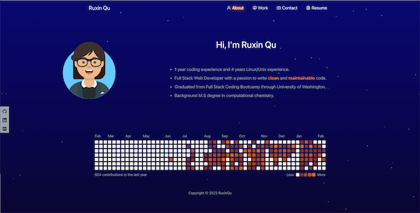

# react-portfolio 

## Description
This is Ruxin Qu's react portfolio. It's made with [create-react-app](https://create-react-app.dev).

View deployed link: https://ruxinqu.github.io/react-portfolio/

## Installation

1. Run `git@github.com:RuxinQu/react-portfolio.git` on the terminal to git clone the repo.
2. Then run `npm install` to download all the packages.
3. Run `npm start` to start the server.

## Usage
1. Click the link and see my portfolio!
2. The website is responsive to different screen sizes.
3. The following animation shows the website's appearance and functionality:

›

## Technologies Used
- [Avataaars2](https://www.npmjs.com/package/avataaars2)
- [React-Icons](https://react-icons.github.io/react-icons/)
- [React-Bootstrap](https://react-bootstrap.github.io)
- [React-Github-Calendar](http://react-component.github.io/calendar/)
- [Bootstrap](https://getbootstrap.com)
- [gh-pages](https://www.npmjs.com/package/gh-pages)
- [SVG-loaders](https://github.com/SamHerbert/SVG-Loaders)

## Contact Me
Email: ruxinqu@gmail.com