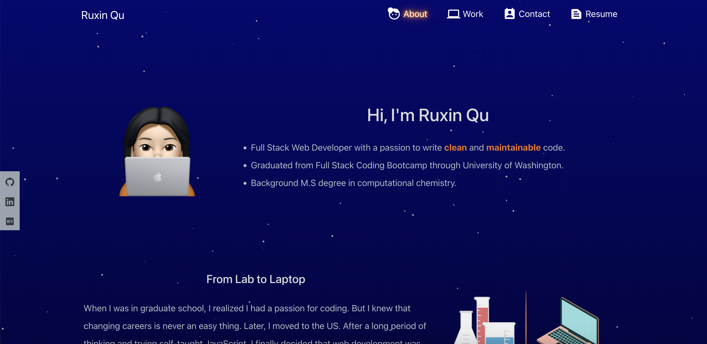

# react-portfolio

## Description

This is client side of Ruxin Qu's react portfolio.

View deployed link: http://portfolio.ruxinqu.net

## Installation

1. Run `git@github.com:RuxinQu/react-portfolio.git` on the terminal to git clone the repo.
2. Then run `npm install` to download all the packages.
3. Run `npm start` to start the server.

## Usage

1. Click on the link to view my portfolio!
2. The website is designed to be responsive to different screen sizes.
3. Users are able to send messages through the contact form.
4. The following animation demonstrates the website's appearance and functionality.

›
